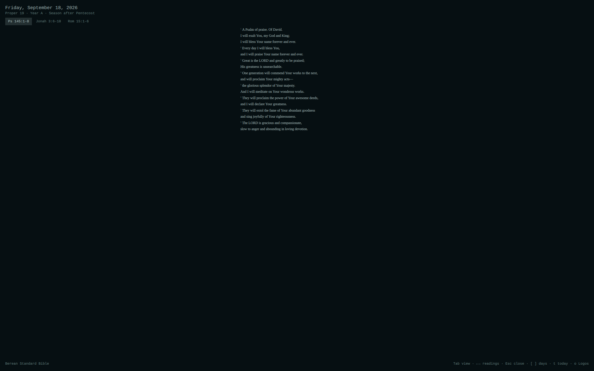
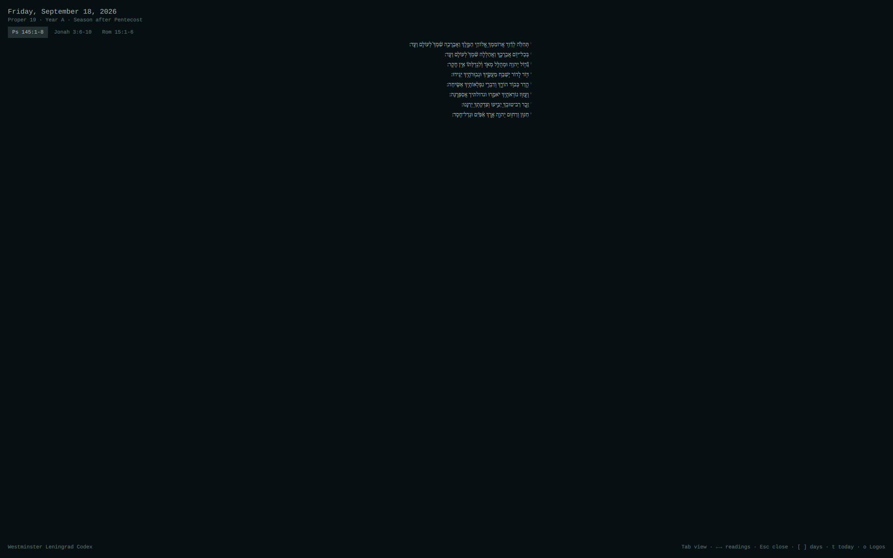

# Omalectionary

Today's liturgical day on the bar, tinted by the season's color, with a
tooltip naming the day's appointed readings. Click it (or hit a keybinding)
to open a full overlay showing one reading at a time -- English (Berean
Standard Bible), the original language (Greek/SBLGNT for the New Testament,
Hebrew/WLC for everything else), or an interlinear of the two -- for both
the Revised Common Lectionary's Sunday/feast readings and its Daily
Lectionary on other days. Entirely offline: all three texts and both
readings tables are bundled as JSON, no network access at runtime.






## Install

```bash
omarchy plugin add https://github.com/gumbledore/omalectionary --enable
```

(No public remote exists yet at the time of writing -- this is the intended
URL once one does.)

Manual alternative -- clone or symlink this repo into the plugin directory
yourself, then enable it:

```bash
ln -s /path/to/this/repo ~/.config/omarchy/plugins/gumbledore.omalectionary
omarchy plugin enable gumbledore.omalectionary right
```

## Keybinding

Add to `~/.config/hypr/bindings.conf`:

```
bindd = SUPER SHIFT, L, Lectionary, exec, ~/.config/omarchy/plugins/gumbledore.omalectionary/bin/omalectionary show-overlay
```

## Using it

Click the bar widget (or the keybinding above) to open the overlay.

| key | |
|---|---|
| `Tab` / `Shift+Tab` | cycle view: English -> original language -> interlinear |
| `←` `→` / `h` `l` | switch reading (first lesson, psalm, second lesson, gospel) |
| `1`-`9` | jump to a reading by number |
| `↑` `↓` / `j` `k` / `PageUp` `PageDown` | scroll the current reading |
| `[` `]` | browse a day back/forward (clamped to +/-7 days) |
| `t` | return to today |
| `o` | open the active reading in Logos (via a ref.ly URL) |
| `Esc` | close the overlay |

## Configuration

`~/.config/omalectionary/config.json`:

```json
{ "track": 2 }
```

The RCL's Sunday readings offer two tracks for the season after Pentecost:
Track 1 pairs the Old Testament reading with the gospel semi-continuously
(a running story each week); Track 2 (the default) pairs it thematically/
complementarily with the gospel instead. Outside that season the two tracks
agree, so this only matters roughly June-November. Missing file or an
invalid value both fall back to Track 2.

State (which view -- English/original/interlinear -- was last open) is kept
separately at `~/.local/state/omalectionary/state.json` and is not meant to
be hand-edited.

## Lectionary notes

Sunday/feast readings are the Revised Common Lectionary (RCL) on the
Consultation on Common Texts (CCT) base cycle; weekday readings are the
RCL's companion Daily Lectionary. A weekday's readings come from whichever
neighboring Sunday/feast it belongs to: Monday-Wednesday respond to the
*past* Sunday, Thursday-Saturday prepare for the *coming* one (Easter Week
is a documented exception with its own Monday-Saturday octave). See
`Lectionary.js`'s header comments for the exact resolution rules.

**A candid note on accuracy:** the Sunday table (`data/sundays.js`) and
Daily Lectionary table (`data/daily.js`) were transcribed by hand from
published RCL references and have only been partly spot-checked against
Vanderbilt Divinity Library's lectionary pages
(https://lectionary.library.vanderbilt.edu/). Treat any single reference as
worth double-checking before relying on it publicly. If you find one wrong,
it's a one-line fix: find the day's key (e.g. `"proper-19"`, `"easter"`) and
year/slot in `data/sundays.js` (Sundays/feasts) or `data/daily.js` (weekdays,
keyed by the governing Sunday/feast plus `mon`/`tue`/`wed`/`thu`/`fri`/`sat`),
and edit the reference string in place.

## Texts and licenses

- **English** -- Berean Standard Bible (BSB), public domain (CC0).
- **Greek** -- SBL Greek New Testament (SBLGNT), CC BY 4.0. Scripture
  quotations marked SBLGNT are from the SBL Greek New Testament. Copyright
  (c) 2010 Society of Biblical Literature and Logos Bible Software.
- **Hebrew** -- Westminster Leningrad Codex (WLC), public domain.

Full license texts and sources are in `LICENSES/` (`BSB.txt`, `SBLGNT.txt`,
`WLC.txt`).

The `o` key opens the active reading in Logos via a `https://ref.ly/...`
URL, with no version suffix, so it opens in whichever Bible is set as your
Logos preferred version -- not necessarily the BSB shown in the overlay.

## Fonts

The overlay's original-language and interlinear views render Greek (SBLGNT)
and Hebrew (WLC) text. Font availability is resolved at runtime against
`Qt.fontFamilies()` with a preference list, falling back through several
options before landing on the shell's own serif -- so nothing is required,
but the specialist fonts render noticeably better (full polytonic Greek
diacritics; Hebrew points and cantillation marks with correct spacing).

- **Greek** -- preference order: SBL Greek, Gentium Plus, Cardo, Libertinus
  Serif, Noto Serif. `noto-fonts` (official `extra` repo, usually already
  installed) covers Greek reasonably via Noto Serif. For a purpose-built
  polytonic Greek face, install `ttf-gentium-plus` or `ttf-libertinus`
  (both in the official `extra` repo). SBL Greek itself isn't packaged for
  Arch; download it from https://sblgnt.com/ and install manually
  (`~/.local/share/fonts/`) if you want it specifically.
- **Hebrew** -- preference order: SBL Hebrew, Ezra SIL, Taamey Frank CLM,
  Noto Serif Hebrew, Noto Sans Hebrew, David CLM. `noto-fonts` (official
  `extra` repo) already ships Noto Serif Hebrew and Noto Sans Hebrew with
  full point/cantillation coverage -- no extra install needed for a good
  default. For a traditional Masoretic face, SBL Hebrew and Ezra SIL aren't
  packaged for Arch either; they're free downloads (SBL Hebrew from
  https://www.sbl-site.org/educational/biblicalfonts.aspx, Ezra SIL from
  https://software.sil.org/ezra/).

If fontconfig can't find any of the preferred families, the overlay falls
back to its normal English serif -- Hebrew/Greek glyphs missing from that
font render as tofu boxes rather than crashing, so installing better fonts
is a quality upgrade, not a requirement.

## Building the texts

`data/bsb.json`, `data/sblgnt.json`, and `data/wlc.json` are pre-built and
committed -- most users never need this section. To rebuild them (e.g. to
pick up an upstream update):

```bash
cd build
uv run convert_bsb.py       # needs sources/bsb_usfm.zip
uv run convert_sblgnt.py    # needs sources/SBLGNT-master/ (unzipped)
uv run convert_wlc.py       # needs sources/morphhb-master/ (unzipped)
```

Each script's header comment gives the exact download URL for its source.
`build/sources/` is gitignored; drop the fetched zip/unzipped source there
before running the matching script.

## Development

```bash
tests/run.sh
```

Runs the pure-JS calendar/lectionary/text/browse modules under `node`
(fixture sweeps against known dates and references) plus a shell-level
check of the `open-logos` URL validation. No QML test runner -- `Overlay.qml`
and `BarWidget.qml` are exercised by hand against a running shell.

## License

MIT. See `LICENSE`. Bundled texts carry their own licenses -- see
`LICENSES/` and "Texts and licenses" above.
